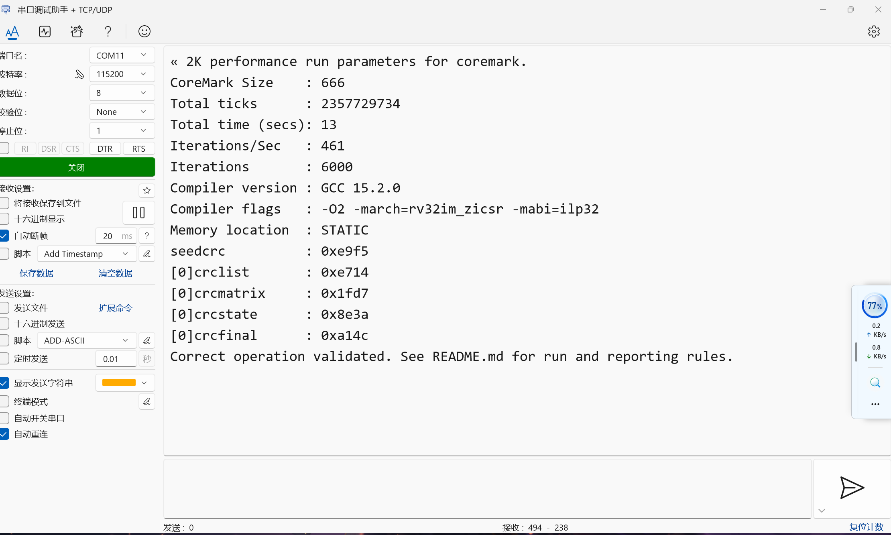

# RISC-V CPU Refactored

这是一个面向毕业设计与体系结构实验的 RV32 RISC-V CPU 工程。仓库包含 CPU 核心 RTL、SoC 外设封装、仿真测试平台、测试 hex 文件以及设计文档。

当前 `main` 分支保留无 cache 的基础版本，适合作为后续流水线、外设、双发射或 cache 设计的共同起点。

## 项目结构

```text
rtl/
  cpu_top/              五级流水线 CPU 核心
  my_cpu/               SoC 顶层、总线桥、UART、PLIC、timer、IO 等外设
test/                   SystemVerilog 测试平台
hex/                    仿真使用的指令与数据镜像
doc/                    设计文档、框图、移植说明与扩展说明
riscv_sim_perf_bench/   简单性能测试程序与生成结果
claude_work/            架构图与阶段性设计材料
my_cpu_mmio.h           FPGA 软件工程使用的 MMIO/CSR 头文件
coremark测试结果.png    FPGA 实现上的 CoreMark 测试截图
```

## CPU 核心

`rtl/cpu_top` 中的 CPU 核心采用经典五级流水线组织：

- `if_stage.sv`：取指阶段
- `id_stage.sv`：译码与寄存器读取
- `exe_stage.sv`：执行阶段，包含整数执行路径与乘除法控制
- `mem_stage.sv`：访存阶段
- `wb_stage.sv`：写回阶段
- `regfiles.sv`、`regfile_csr.sv`、`reg_fpu.sv`：通用寄存器、CSR 与浮点相关寄存器
- `mul.sv`、`divider.sv`、`fpu.sv`：运算单元
- `defines.svh`：核心参数、总线宽度与宏定义

## SoC 与外设

`rtl/my_cpu` 提供 CPU 外围系统封装，主要包括：

- `my_cpu.sv`：SoC 顶层
- `bridge.sv`：CPU 与外设/存储器之间的访问桥接
- `UART.sv`：串口模块
- `PLIC.sv`：平台级中断控制器
- `timer.sv`：定时器模块
- `IO.sv`：基础 IO 映射

## 仿真入口

根目录 `markdown.md` 中记录了一个基础编译命令：

```text
vlog rtl/cpu_top/*.sv rtl/cpu_top/*.svh rtl/my_cpu/*.sv rtl/my_cpu/*.svh test/*.sv
```

常用测试平台位于 `test/`：

- `tb_cpu_top.sv`：CPU 核心测试
- `tb_my_cpu.sv`、`tb_top.sv`：SoC 层级测试
- `tb_UART.sv`、`tb_PLIC.sv`、`tb_timer.sv`：外设测试

仿真输入镜像位于 `hex/`，其中 `hex/riscv-tests/` 保存了多组 RISC-V 指令测试用例。

## FPGA 软件支持

根目录的 `my_cpu_mmio.h` 来自另一工作区中的 FPGA 实现，可直接作为裸机 C 程序的软件侧硬件抽象头文件。它包含：

- 基础 `mmio_read32` / `mmio_write32` 访问函数
- DRAM、benchmark 数据区和启动地址定义
- UART、timer、LED、PLIC 地址映射与控制位定义
- 机器模式 CSR 编号与 `read_csr` / `write_csr` 宏
- 自定义性能计数 CSR：cycle、instret、branch、branch miss、load-use stall、execute stall、exception 等
- PLIC 与 UART polling 的轻量辅助函数

该头文件适合放入裸机软件或 benchmark 工程中，用于和本 CPU/SoC 的 FPGA 地址映射保持一致。

## FPGA CoreMark 测试

以下截图记录了另一工作区中 FPGA 实现运行 CoreMark 的测试结果：



## 文档

推荐先阅读以下文档：

- `doc/design_porting_summary.md`
- `doc/c_software_porting_reference.md`
- `doc/z_extensions_summary.md`
- `doc/figures/` 下的流水线与数据通路图

## 分支说明

- `main`：无 cache 基础版本。
- `cache`：cache 相关设计与后续改造分支。
- `codex/dual-issue-design`：从无 cache 基线出发的双发射设计初始化分支。
